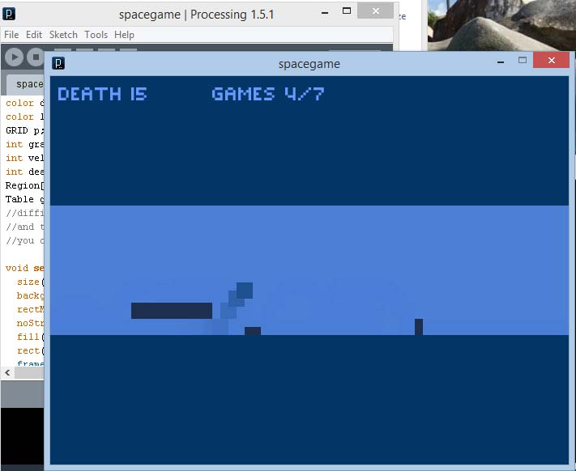
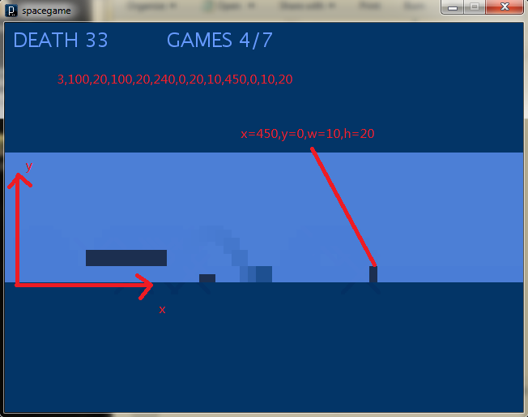

# 空格游戏
processing 1.5.1

用Processing模仿实现的一款空格游戏，按空格跳跃躲避障碍物。

# 玩法说明
游戏开始后小方块会出左侧出现并向右侧运动，玩家需要在合适的时机按下空格键跳起，以躲避各种障碍物。如果不小心撞上了，那就会“死”一次并自动重来，游戏最后看谁死的次数少。

# 关卡文件说明

每一行为一关的所有障碍物数据。

障碍物的数据构成：
左下角x坐标，左下角y坐标，障碍物宽，障碍物高

